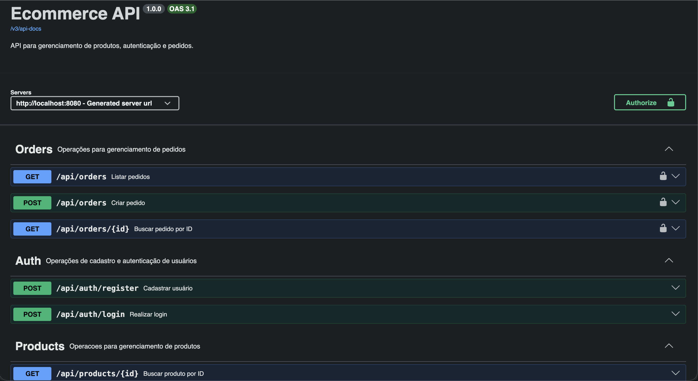
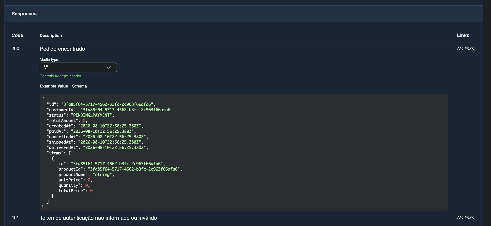
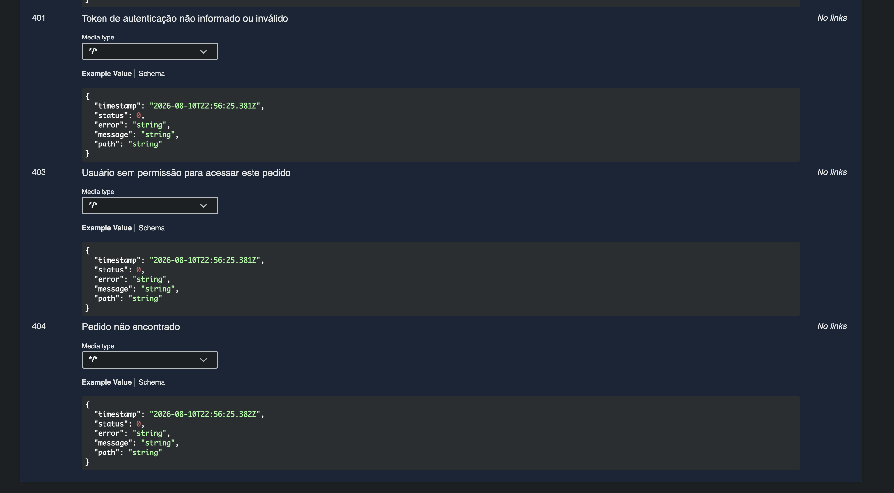

# Ecommerce API

API REST de ecommerce desenvolvida em Java e Spring Boot, com arquitetura modular, autenticação JWT, controle de acesso por perfil, persistência com PostgreSQL, migrations com Flyway e testes automatizados.

O projeto simula um backend de loja com cadastro de produtos, criação de pedidos, baixa de estoque, pagamento simulado com idempotência e proteção de rotas por perfil.

## Destaques Técnicos

- Monólito modular com separação entre `domain`, `application`, `infrastructure` e `api`.
- Regras de negócio encapsuladas em entidades de domínio, sem setters públicos indiscriminados.
- Autenticação com JWT e autorização por perfis `ADMIN` e `CUSTOMER`.
- Criação de pedidos com validação de produto ativo e baixa automática de estoque.
- Pagamento simulado com aprovação, recusa, idempotência e atualização transacional do pedido.
- Migrations versionadas com Flyway e validação de schema via Hibernate `ddl-auto=validate`.
- Testes unitários e de integração com JUnit 5, AssertJ, Mockito e Testcontainers.
- Observabilidade básica com `X-Request-Id`, MDC e logs estruturados por requisição.
- Documentação HTTP com Swagger/OpenAPI.
- Pipeline de CI com GitHub Actions.

## Stack

```text
Java 25
Spring Boot 4
Spring Web MVC
Spring Security
Spring Data JPA
PostgreSQL
Flyway
JWT
BCrypt
Bucket4j
Maven
Docker Compose
Swagger/OpenAPI
JUnit 5
AssertJ
Mockito
Testcontainers
GitHub Actions
```

## Arquitetura

O projeto usa Maven multi-módulo para deixar as responsabilidades explícitas:

```text
ecommerce-domain          regras de negócio, entidades e enums
ecommerce-application     casos de uso, commands, responses, mappers e contratos
ecommerce-infrastructure  JPA, repositories, PostgreSQL, Flyway e segurança
ecommerce-api             controllers, requests, Swagger, filtros e tratamento de erros
```

Direção principal das dependências:

```text
ecommerce-api -> ecommerce-application -> ecommerce-domain
ecommerce-api -> ecommerce-infrastructure -> ecommerce-application/domain
```

Essa organização mantém regras de negócio longe de detalhes de HTTP, banco e segurança.

## Funcionalidades

- Cadastro, login e autenticação com JWT.
- Autorização por perfil `ADMIN` e `CUSTOMER`.
- CRUD de produtos com delete lógico.
- Criação de pedidos com baixa automática de estoque.
- Listagem de pedidos com paginação e filtros.
- Busca de pedido por ID.
- Pagamento simulado de pedido.
- Idempotência no processamento de pagamento.
- Tratamento padronizado de erros.
- Rate limit por origem da requisição.
- Request ID e logs estruturados por requisição.
- Health check com Spring Boot Actuator.

## Fluxo De Pedido E Pagamento

Ao criar um pedido, a API valida produtos ativos, verifica estoque, calcula o total no backend e reduz o estoque dentro da transação.

```text
PENDING_PAYMENT -> PAID
```

O pagamento é simulado, mas segue regras importantes de sistemas reais:

- O cliente não informa o valor do pagamento.
- O valor pago vem de `order.totalAmount`.
- Pagamento aprovado muda o pedido para `PAID`.
- Pagamento recusado fica registrado como `REJECTED`.
- Pagamento recusado mantém o pedido em `PENDING_PAYMENT`.
- A mesma `Idempotency-Key` para o mesmo pedido retorna o pagamento já processado.
- Cliente só pode pagar os próprios pedidos.

Endpoint:

```http
POST /api/orders/{orderId}/payments
Authorization: Bearer <token>
Idempotency-Key: <chave-unica>
```

Body:

```json
{
  "method": "PIX",
  "approved": true
}
```

Métodos aceitos:

```text
PIX
CREDIT_CARD
```

## Segurança

Rotas públicas:

```text
POST /api/auth/register
POST /api/auth/login
GET  /api/products
GET  /api/products/{id}
GET  /docs
GET  /v3/api-docs
GET  /actuator/health
```

Rotas protegidas:

```text
GET    /api/orders
GET    /api/orders/{id}
POST   /api/orders
POST   /api/orders/{orderId}/payments
POST   /api/products
PUT    /api/products/{id}
DELETE /api/products/{id}
```

Regras principais:

- `CUSTOMER` cria pedidos, paga pedidos e consulta apenas os próprios pedidos.
- `ADMIN` gerencia produtos.
- Token ausente ou inválido retorna `401 Unauthorized`.
- Falta de permissão retorna `403 Forbidden`.

## Tratamento De Erros

As respostas de erro seguem um formato único:

```json
{
  "timestamp": "2026-08-06T16:34:24.556386Z",
  "status": 401,
  "error": "Unauthorized",
  "message": "Token de autenticação não informado ou inválido.",
  "path": "/api/orders"
}
```

Erros tratados:

- validação de request
- recurso não encontrado
- regra de negócio
- falta de permissão
- token ausente ou inválido
- excesso de requisições
- erro inesperado

## Observabilidade

Cada requisição recebe um identificador de rastreamento no header `X-Request-Id`.

Se o cliente enviar esse header, a API reutiliza o valor. Se não enviar, a API gera um UUID e devolve o identificador na resposta.

Os logs HTTP são emitidos em formato `key=value` com os principais campos da requisição:

```text
http_request requestId=<id> method=POST path=/api/orders status=201 durationMs=42 userId=<uuid> role=CUSTOMER
```

O `requestId` também é colocado no MDC, permitindo correlacionar logs internos gerados durante a mesma requisição.

## Como Rodar

Crie um arquivo `.env` na raiz do projeto:

```env
POSTGRES_DB=ecommerce
POSTGRES_USER=ecommerce
POSTGRES_PASSWORD=change_me
POSTGRES_PORT=5432
API_PORT=8080
JWT_SECRET=change_me_with_at_least_32_characters
JWT_EXPIRATION_SECONDS=3600
RATE_LIMIT_ENABLED=true
RATE_LIMIT_CAPACITY=60
RATE_LIMIT_REFILL_TOKENS=60
RATE_LIMIT_REFILL_DURATION_SECONDS=60
```

Suba banco, instale os módulos e rode a API:

```bash
make dev
```

A API ficará disponível em:

```text
http://localhost:8080
```

Swagger UI:

```text
http://localhost:8080/docs
```

OpenAPI JSON:

```text
http://localhost:8080/v3/api-docs
```

## Documentação Interativa

A API expõe uma documentação interativa com Swagger, permitindo autenticar com JWT, testar endpoints protegidos e visualizar exemplos de respostas.

Visão geral dos endpoints:



Exemplo de resposta de sucesso:



Exemplo de respostas de erro padronizadas:



Comandos úteis:

```bash
make db-up
make db-down
make docker-up
make docker-down
make test
make build
```

## Docker

Para subir API e PostgreSQL juntos:

```bash
make docker-up
```

Para parar:

```bash
make docker-down
```

O container da API possui healthcheck:

```text
GET /actuator/health/readiness
```

## Testes

Rodar todos os testes:

```bash
./mvnw test
```

Validar build completo:

```bash
./mvnw verify
```

Os testes cobrem:

- regras de domínio
- casos de uso da aplicação
- fluxo de pagamento simulado
- idempotência de pagamento
- criação e validação de JWT
- autenticação e autorização na API
- endpoint de pagamento com JWT
- rate limit
- geração e propagação de `X-Request-Id`
- adapters de persistência com PostgreSQL real via Testcontainers
- execução das migrations Flyway nos testes de integração

## CI/CD

O projeto possui pipeline com GitHub Actions em:

```text
.github/workflows/ci.yml
```

A cada `push` ou `pull_request` para `main` ou `master`, o pipeline executa:

```bash
./mvnw test
./mvnw verify
```

## Estrutura

```text
.
├── .github/workflows
├── ecommerce-api
├── ecommerce-application
├── ecommerce-domain
├── ecommerce-infrastructure
├── docker-compose.yml
├── Dockerfile
├── Makefile
└── pom.xml
```

## Próximos Passos

- Cancelamento de pedido com devolução de estoque.
- Avanço de status do pedido: em preparação, enviado e entregue.
- Collection Postman/Insomnia.
